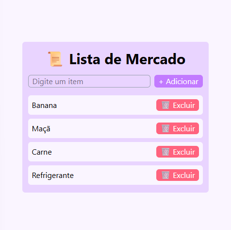

# 🧾 Lista de Mercado - React + TailwindCSS



> Interface leve, colorida e intuitiva para gerenciar sua lista de compras! 🛒

---

## 📺 Aula-base do projeto

[**Como sair do Zero no React em Apenas UMA AULA**](https://www.youtube.com/watch?v=6hiqVVCsA_I)
🎓 Canal: **Hashtag Programação**

---

## 🚀 Tecnologias Utilizadas


---

### ⚙️ Instalação e uso

```bash
# 1. Criar projeto com Vite
npm create vite@latest

# 2. Instalar dependências
npm install

# 3. Rodar o servidor
npm run dev
```

---

## 📚 Conceitos importantes aprendidos

### 🧩 Conceitos de React

* **Componente:** Entidade que representa algo na interface. Funciona de forma independente e reutilizável.
* **Fragment (`<> </>`):** Tag vazia que envolve múltiplos elementos no `return`. Necessário pois o `return` do componente só aceita um elemento pai.
* **StrictMode:** Utilizado apenas em desenvolvimento. Faz o React renderizar duas vezes os componentes para detectar problemas.
* **Props:** São parâmetros passados para componentes — ajudam a torná-los reutilizáveis.
* **Erro comum:**

  ```
  Each child in a list should have a unique "key" prop.
  ```

  Isso acontece porque cada item de uma lista precisa de uma `key` única para que o React consiga identificar e atualizar os elementos corretamente.

---

### 🪝 Hooks

* **`useState`**

  ```js
  const [valor, setValor] = useState(0);
  ```

  Cria um estado local. Retorna um array com a variável e uma função para alterá-la.

* **`useRef`**

  ```js
  const inputRef = useRef(null);
  ```

  Cria uma referência para acessar diretamente elementos da DOM ou armazenar valores persistentes.

---

### 🛠 Ferramentas e Extensões Recomendadas

* **ES7+ React Snippets** (atalho: `rafce`)
* **Tailwind CSS IntelliSense**
* **Prettier + Tailwind Plugin**

```bash
npm install -D prettier prettier-plugin-tailwindcss
```

Configuração no `package.json`:

```json
"prettier": {
  "plugins": ["prettier-plugin-tailwindcss"]
}
```

---

### 💡 Resultado

A aplicação é uma **Lista de Mercado interativa** onde o usuário pode adicionar e excluir itens dinamicamente com uma experiência agradável e fluída!
